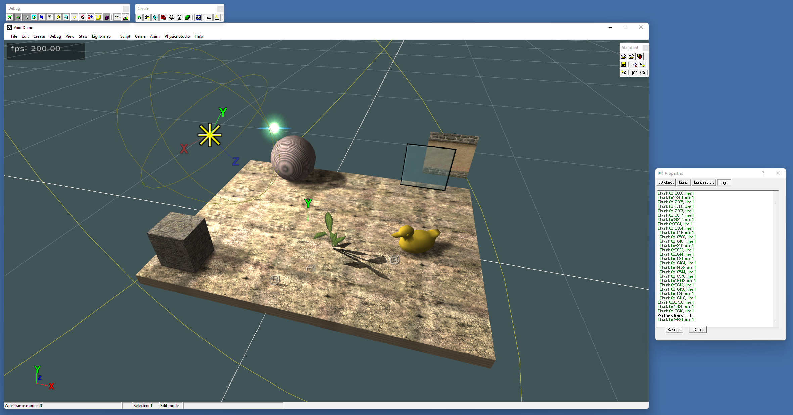

    

    
    

 

  Void 3D Game engine

  
    Based on <a href="https://github.com/mice777/Insanity3D">Insanity3D</a> made by <a href="https://github.com/mice777">mice777</a>,
    improved by <a href="https://github.com/zaklaus">@zaklaus</a>,
    <a href="https://github.com/DavoSK">@DavoSK</a>,
    and other contributors!
  

## Introduction

3D engine originally developed by Lonely Cat Games, now continued by the open source community, contributions are welcome!

This fork offers the following changes:
- Updated to support the latest MSVC compiler set
- Increased shadowmap resolution
- Various editor enhancements and fixes
- Experimental 4DS model format support (used in Mafia: The City of Lost Heaven for example)

Structure of the project:

- DirectX - needed headers and libraries for DirectX
- Docs - documentation on how the engine and editor works
- Include - C++ header files
- lib - compiled libs (these can be compiled from sources)
- Source - C++ source files for all parts of engine
- Tools - compiled 3DS Max 4/7 plugins
- Editor - Editor sources and binaries
  - _src - source file
  - Bin - precompiled binaries - start the app from here
  - Maps - textures
  - Missions - 3D scenes
  - Models - 3D models

## Build Instructions

This project can be compiled under Microsoft Visual Studio 2019 and up.

Open up Editor/_src/ITest.sln and compile the project!

## Trivia

The original Insanity3D engine was used for PC game *Hidden and Dangerous*

Insanity3D is not maintained since 2004, but it still shows some nice techniques: physics, sectors+portals, occluders, bump/detail/light/environment -mapping, human animations, BSP tree, collisions, rain, snow, level-of-detail, particles, scripting, shadows, etc.  
